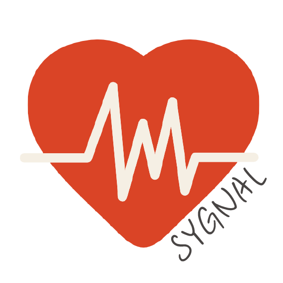
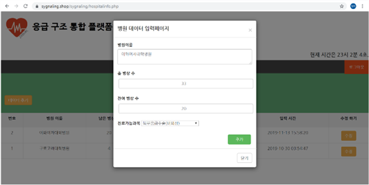
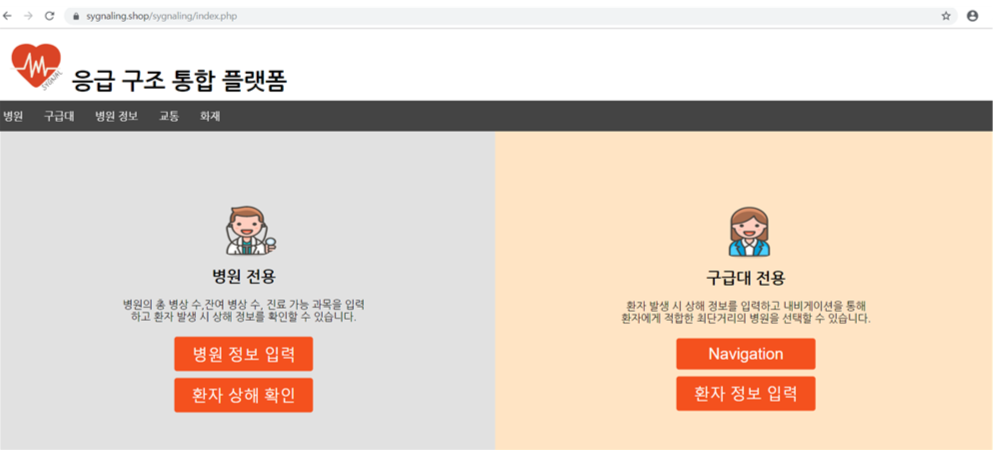
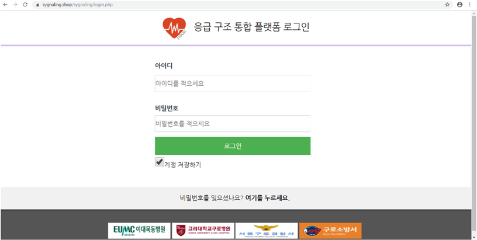
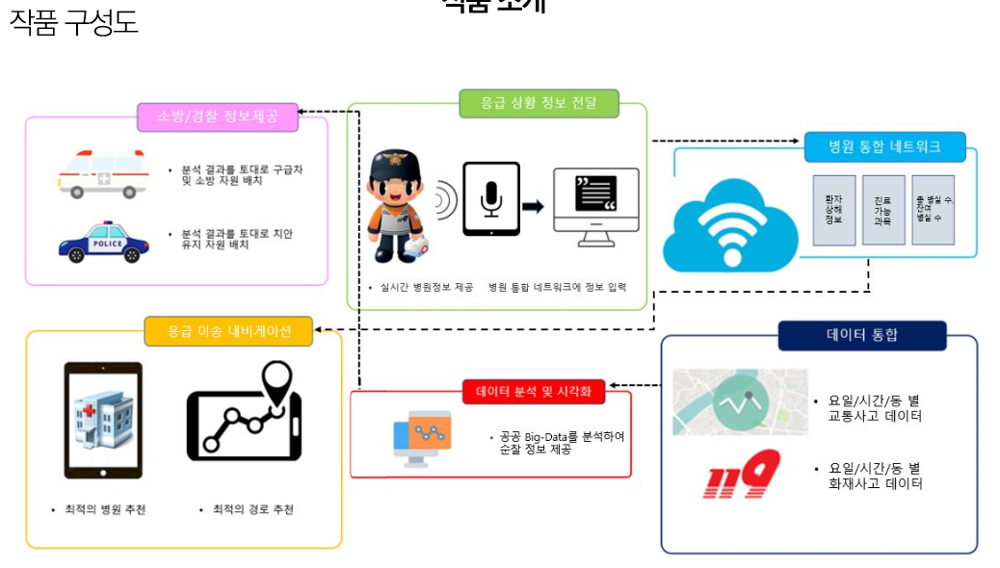

# Save Your Golden hour (SYGnal hanium_2019)

__Save Your Golden hour (SYGnal)__

__구급 대원-병원 간 환자/병원 정보를 공유하고 신속한 환자 이송 및 치료에 차질이 없도록 하는 응급구조 통합 플랫폼__ 입니다.

It is an emergency rescue integrated platform that shares patient/hospital information between emergency personnel and hospitals and ensures rapid patient transport and treatment.

## 👨‍💻프로젝트 주요 내용

 ● 응급실 상태 수시 업데이트
 
 

 ● 응급환자에게 적합한 병원 탐색 및 네비게이션
 
 

 ● 이송중인 환자의 기본 정보 공유
 
 

 
 ● 이송중인 환자의 Vital Sign 공유
 
 ● 이송중인 환자의 긴급추가정보 공유
 
 ● 빅데이터 기반 응급사고 발생 예측

## 📑작품 구성도

## 📑사이트 정리

##### 시연 동영상 https://www.youtube.com/watch?v=rggwBr-9UeI
##### annyang https://www.talater.com/annyang/
##### page https://sygnaling.shop/sygnaling/index.php
